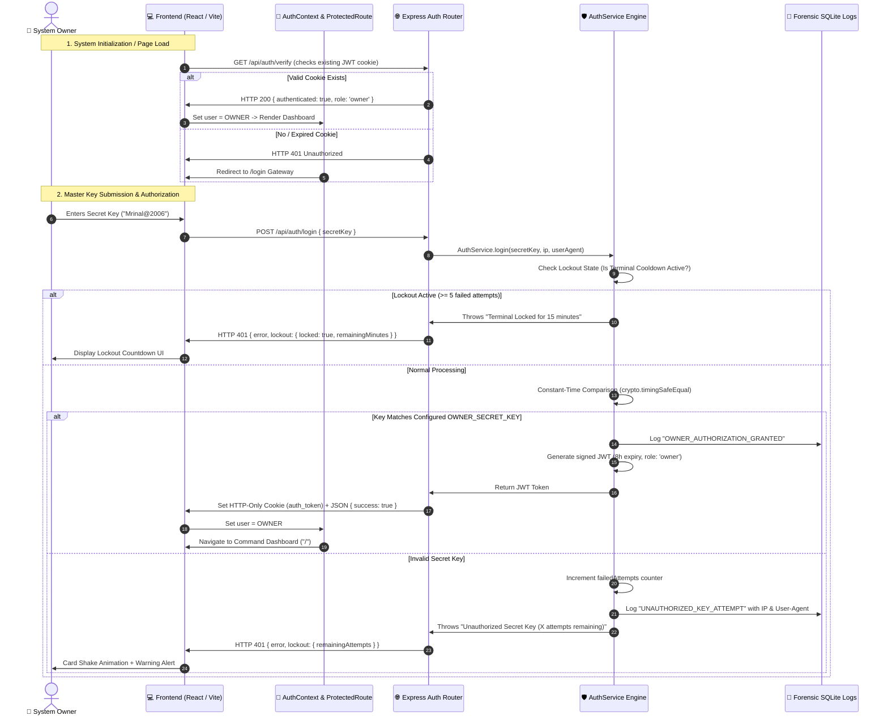

# 🔐 Single-Owner Master Secret Key Authentication System

## 🌟 Overview & Architecture

The **HawkEye Surveillance Command Center** employs a dedicated **Single-Owner Master Secret Key Gateway**.

Instead of traditional multi-user username/password models—which introduce account management vulnerabilities, credential leaks, and multi-tenancy attack surfaces—the system is locked to a single proprietary access key. Access is granted exclusively to the owner possessing the valid secret key.

---

## 🏛️ System Authentication Flow Diagram



---

## 🔄 Step-by-Step Execution Order

### Phase 1: Client-Side Session Hydration
1. **Route Interception**: When a user opens the application (e.g., `http://localhost:3000/`), [ProtectedRoute.jsx](file:///c:/Users/mrina/Documents/surveillance%20system/client/src/components/auth/ProtectedRoute.jsx) checks if an authenticated session exists.
2. **Silent Verification**: [AuthContext.jsx](file:///c:/Users/mrina/Documents/surveillance%20system/client/src/context/AuthContext.jsx) sends a background request to `GET /api/auth/verify` with `credentials: 'include'`.
3. **Session Re-use**: If an active `auth_token` HTTP-only cookie exists and passes JWT signature verification, the backend returns `{ authenticated: true, role: 'owner' }`, and the user is instantly admitted without having to re-enter the key.
4. **Gateway Redirect**: If no valid session is found, the user is redirected to the `/login` Master Secret Key Gateway.

---

### Phase 2: Gateway Authentication Request
1. **Key Input**: The owner enters the passkey into the cyber-styled input field on [Login.jsx](file:///c:/Users/mrina/Documents/surveillance%20system/client/src/pages/Login.jsx).
2. **Payload Dispatch**: The frontend dispatches a `POST /api/auth/login` request with `{ secretKey: "..." }`.
3. **Lockout Check**: [AuthService.js](file:///c:/Users/mrina/Documents/surveillance%20system/server/src/services/auth.service.js) first verifies whether the terminal is under a 15-minute brute-force lockout.

---

### Phase 3: Cryptographic Validation
1. **Buffer Conversion**: The submitted string and the configured server key (`OWNER_SECRET_KEY`) are converted into byte buffers:
   ```javascript
   const submittedBuffer = Buffer.from(submittedSecretKey.trim());
   const configuredBuffer = Buffer.from(configuredKey.trim());
   ```
2. **Timing-Safe Evaluation**: `crypto.timingSafeEqual(submittedBuffer, configuredBuffer)` executes a constant-time memory comparison.
   - **Why this matters**: Standard `===` string equality returns early on the first mismatched character, allowing attackers to measure microscopic CPU execution times (timing attacks) to guess characters one by one. `timingSafeEqual` takes the exact same duration regardless of matching or non-matching characters.

---

### Phase 4: Authorization Decision & Session Issuance
- **Case A — Key is Valid**:
  - Failed attempt counters are reset to zero.
  - A forensic audit entry (`OWNER_AUTHORIZATION_GRANTED`) is recorded in SQLite.
  - An 8-hour cryptographic JWT is signed with the server's `JWT_SECRET`:
    ```json
    {
      "role": "owner",
      "username": "OWNER",
      "authType": "secret_key",
      "iat": 1790017668,
      "exp": 1790046468
    }
    ```
  - The JWT is dispatched via a secure **HTTP-Only Cookie** (`auth_token`), preventing JavaScript XSS access to the token.
  - The frontend transitions into the Command Dashboard with a smooth entrance animation.

- **Case B — Key is Invalid**:
  - The failed attempt counter increments by `+1`.
  - An audit log (`UNAUTHORIZED_KEY_ATTEMPT`) records the intruder's IP address, User-Agent, and timestamp.
  - If attempts reach `5`, the terminal locks for **15 minutes**.
  - The frontend executes an alert shake animation and warns the user of remaining attempts.

---

## 🎯 Impact on the System

| Dimension | Previous Multi-User System | New Single-Owner Secret Key Gateway |
| :--- | :--- | :--- |
| **Attack Surface** | High (username enumeration, credential stuffing, password spray, SQL/JSON user table attacks) | **Minimal** (Single gatekeeper key, zero multi-user endpoints) |
| **Credential Storage** | Sensitive password hashes stored in database rows | **Zero credentials in database**; verified directly against server environment configuration |
| **Timing Attack Resistance** | Standard string / hash comparisons | **Constant-time comparison (`crypto.timingSafeEqual`)** |
| **Brute-Force Protection** | Account-level lockout | **Terminal-wide progressive lockout (5 strikes = 15m cooldown)** |
| **User Experience** | Two-field login (Username + Password) + multi-step setup wizards | **Single streamlined Master Passkey terminal** with auto-session restore |
| **Database Overhead** | `admin` user rows, salt generations, migration schemas | **Lightweight forensic audit trail only (`auth_logs`)** |

---

## ⚙️ Key Configuration & Customization

The master secret key can be inspected or modified in two locations:

1. **Environment File (Primary)**:
   [server/.env](file:///c:/Users/mrina/Documents/surveillance%20system/server/.env)
   ```env
   OWNER_SECRET_KEY=Mrinal@2006
   ```

2. **YAML Configuration (Secondary Fallback)**:
   [config.yaml](file:///c:/Users/mrina/Documents/surveillance%20system/config.yaml)
   ```yaml
   auth:
     owner_secret_key: Mrinal@2006
     token_expiry_hours: 8
     max_failed_attempts: 5
     lockout_duration_minutes: 15
   ```

To change the key in the future, simply update `OWNER_SECRET_KEY` in `server/.env`. The change takes effect immediately without needing database migrations.
